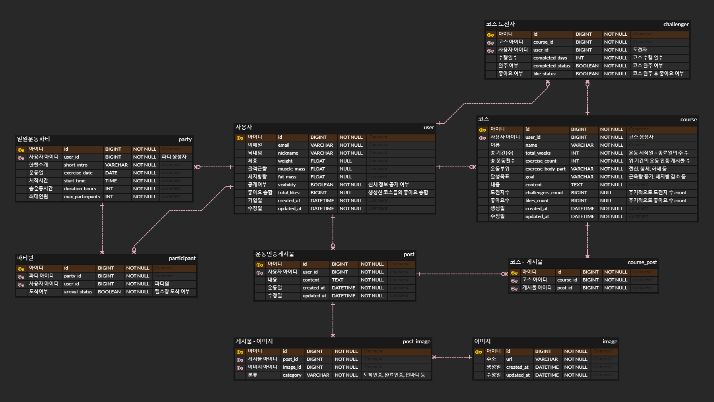

# 페이스메이커

막상 헬스장 가면 운동 잘하는데, 헬스장 가기까지가 제일 큰 고비인 사람들,  
다른 사람들의 운동 루틴을 따라 해보고 싶은 사람들을 위한 서비스입니다.

## 프로젝트 기능 및 설계

- 회원가입 & 로그인 기능
    - 카카오 오픈 API 를 활용하였습니다.
    - 사용자는 카카오톡 아이디로 간편하게 회원가입 및 로그인을 할 수 있습니다.
    - 모든 기능은 로그인 사용자만 이용 가능합니다.

- 일일 운동 파티 모집 기능
    - 사용자는 일일 운동 파티를 생성할 수 있습니다.
    - 파티 생성 시 입력받는 내용은 다음과 같습니다.
      - 파티 소개글(한 줄), 운동일, 시작시간, 총운동시간, 최대모집인원

- 일일 운동 파티 검색 기능
    - 사용자는 원하는 날짜를 지정하여 파티를 검색할 수 있습니다.
    - 검색 결과는 운동 시작 시간순으로 정렬됩니다.
    - 검색 날짜가 당일인 경우, 운동시작시간이 검색시간으로부터 1시간 이후인 파티만 검색됩니다.
    - 모집인원이 달성된 파티는 검색되지 않습니다.

- 일일 운동 파티 참가 기능
    - 사용자는 원하는 파티에 참가 신청을 할 수 있습니다.
    - 원하는 파티에 자리가 있다면, 신청 즉시 수락됩니다. 이외에는 거절됩니다.
    - 동시성 이슈가 발생하지 않도록 lock 을 활용하였습니다.

- 헬스장 도착 인증 기능 (운동 인증 게시물 생성)
    - 사용자는 헬스장 도착 인증 게시물을 포스팅할 수 있습니다.
    - 게시물에는 사진 한 장이 필수로 포함되어야 합니다.
    - 이미지 스토리지는 Amazon S3 를 사용하였습니다.
    - 게시물 생성 시 내용란에는 " 오늘 운동 시작 :) " 이 자동으로 입력됩니다.
    - 당일 운동 파티 참가자의 경우, 도착 인증 시 도착상태가 True 로 변경됩니다.
    - 또한 파티원들에게 "ㅇㅇ님이 운동을 시작하셨습니다." 알람이 갑니다.

- 파티원 도착 미인증시 알람 기능
    - 일일 파티 운동 시작시간 20분 후, 도착상태가 false 인 경우,
    - 해당 파티원에게 "ㅇㅇ님 힘내서 헬스장에 가볼까요? :) " 알람이 갑니다.

- 운동 완료 인증 기능 (운동 인증 게시물 수정)
    - 사용자는 운동 완료 후, 게시물에 완료 인증 사진을 추가할 수 있습니다.
    - 게시물 내용 또한 자유롭게 수정할 수 있습니다.
    - (해당일 실행한 운동명과 횟수, 식단 병행 유무, 현재 인바디 등)

- 코스 생성 기능
    - 본인의 운동 루틴을 공유하고 싶은 사용자는 코스를 생성할 수 있습니다.
    - 코스 생성 시 입력받는 내용은 다음과 같습니다.
      - 코스 이름, 인증 시작일, 인증 종료일, 운동부위, 달성한 목표, 내용(인바디 변화, 운동 노하우 등)
    - 입력받은 인증 시작일과 종료일로 총 기간(주) 를 계산합니다.
    - 위 기간의 운동인증게시물 수를 카운트하여 총 운동횟수를 계산합니다.

- 코스 검색 기능
    - 사용자는 코스를 검색할 수 있습니다.
    - 검색은 Elastic search 를 활용하였습니다.
    - 검색 결과는 최신순, 도전자수, 좋아요수 순으로 정렬할 수 있습니다.

- 코스 도전 & 좋아요 기능
    - 사용자는 본인이 원하는 코스에 도전할 수 있습니다.
    - 코스 도전자의 경우, 운동인증게시물을 올릴 때마다 수행일수가 증가합니다.
    - 코스의 총운동횟수만큼 수행하였을 경우 완주 상태로 변경됩니다.
    - 완주 시 코스 도전자에게 좋아요를 누를 것인지 물어봅니다.

## ERD

## 트러블 슈팅

[트러블 슈팅 문서로 이동하기](doc/TROUBLE_SHOOTING.md)

## 기술 스택

   
   
   
  

